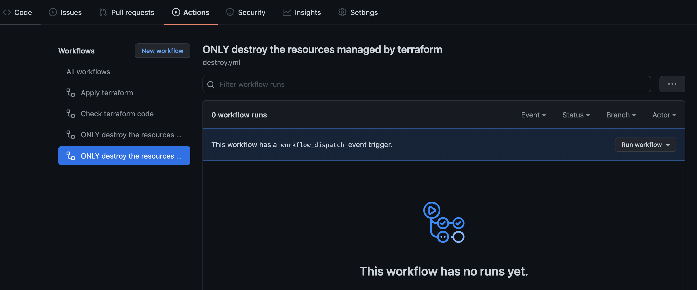

# terraform-vcd-template
This is a template to perform a simple deployment of a ubuntu virtual machine into the AUCloud IaaS platform (VCloud Director), install and turn on apache web server, and present the default apache landing page out via https.


This requires that your tenancy has object storage enabled, and that the account used to login to VCD is an 'organizational administrator'.

The project is setup with automation based on [Github actions](https://docs.github.com/en/actions). This can be ported with minimal changes to other CICD environments.

### Security guidance
This system is simple, however, it is not designed for production use:

1. Passwords *must* be changed.
2. Currently it does not provide an admin access channel except via the web console.
3. Minimal / no Operating system hardening has been performed.
4. The firewall has no restrictions on outbound.


## How it works
The [github workflows](.github/workflows), are designed to execute a simple trunk based development workflow:

- All of the workflows can be triggered manually
- On a PR to main, `terraform plan` and `terraform validate` are run to provide testing.
- On merging a PR to main, `terraform apply` is run

Two manual only workflows exist:
- A [destroy only](.github/workflows/destroy.yml) workflow, which cleans up the environment
- A [destroy workflow, which triggers recreation of resources afterwards](.github/workflows/destroy-recreate.yml), which can be used for refreshing.

## Making it work for your environment
This project requires a number of elements in order for this to work within an AUCloud tenancy


### Upload a Ubuntu cloud image into a catalog
[Ubuntu Cloud images](https://cloud-images.ubuntu.com/) are optimised for automated builds. This demo has been tested with the [Ubuntu 20.04 (Focal Fossa) ova image](https://cloud-images.ubuntu.com/focal/current/focal-server-cloudimg-amd64.ova).
The catalog name and image name will need to be updated in the [tfvars](demo.auto.tfvars) file.

### Setting TFVars
Each of the variables in the `demo.auto.tfvars` file


### Required Github Secrets
Five github secrets are required to be set. The workflows are pre-configured assuming an github secrets environment exist called `demo`.

- `AWS_ACCESS_KEY_ID`: Object storage access key - can be generated from the VCLoud Object Storage Extension
- `AWS_SECRET_ACCESS_KEY`: Object secret access key - can be generated from the VCLoud Object Storage Extension
- `VCD_USER`: VCD username. Takes the form of, in aucloud of `{user-id}@{tenancy-id}` e.g. `100.0@sz000-00-00`.
- `VCD_PASSWORD`: Your VCD password
- `WRITE_ACCESS_TOKEN`: A write access token, for the repository administrator, with the ability to execute actions workflows.
-
### Setting a different password for cloud init
Cloud-init is used to set the user password, update the system, and install apache http server.

The [user password](https://github.com/aucloud/terraform-vcd-template/blob/main/cloudinit/userdata.tmpl#L19), is stored salted and hashed. The default in this demonstration repo is `demo_password`.

**THIS PASSWORD MUST BE CHANGED**

A password hash (tested on ubuntu), can be generated by:

```shell
sudo apt install whois
mkpasswd --method=SHA-512 --rounds=4096 > hash.txt
```

Users are encouraged to pass in the password hash via a github secret combined with a terraform variable.

An alternative is to enable only an ssh key in cloud-init e.g.:
```yaml
users:
  - name: root
    lock_passwd: true
    shell: /bin/bash
    ssh-authorized-keys:
      - # SSH key here; or variable to pass in the key from a terraform variable.
```

## Reference links

- [VCD terraform provider](https://registry.terraform.io/providers/vmware/vcd/latest/docs)
- [Terraform docs](https://developer.hashicorp.com/terraform/docs)
- [VCD docs](https://docs.vmware.com/en/VMware-Cloud-Director/index.html)
- [Cloud init](https://cloud-init.io)
- [AUCloud connect](https://connect.australiacloud.com.au/login/)
- [Github actions docs](https://docs.github.com/en/actions)
- [AUCloud PDCE Portal](https://eportal.australiacloud.com.au)
- [AUCloud ODCE Portal](https://portal.australiacloud.com.au)
- [AUCloud EDCE Portal](https://enterprise.australiacloud.com.au)


## Dealing with broken builds
Builds can get broken for a number of reasons such as:

- Manual editing of resources
- Certain terraform file edits (removing of resources before deletions)
- Problems with the downstream edits

If you are worried about edits
- Test in a non prod-environment OR
- Run a destroy workflow before merging code to ensure clean state

### Triage process
1. Attempt the destroy the resources
   1. Two pipelines are provided for running terraform destroy.
      1. One destroys and leaves it empty
      2. One destroys then triggers recreation of the resources
   2. Use the Workflow dispatch button to ensure code is up to date; and a unique github actions run is recoreded.



If a destroy run fail:
1. Try to repeatedly run destroy.
   1. Some resources may not be correctly coded into the DAG resulting in problems with destructions
2. If all else fails
   1. Manually delete / cleanup resources on the target system.
   2. Remove the state file manually (delete) from object storage.


