# terraform-vcd-template
This is a template to perform a simple deployment of a ubuntu virtual machine into the AUCloud infrastructure, install and turn on apache web server, and present the default apache landing page out via https.

This requires that your tenancy has object storage enabled, and that the account used to login to VCD is an 'organisational administrator'.

The project is setup with automation based on [Github actions](https://docs.github.com/en/actions). This can be ported with minimal changes to other CICD environments.

## Index

- [How it works]( RELLINK - summary)
- [Variables in each AUCloud community environment](./docs/environments.md)
- [Getting your VCD credential information from the AUCloud portal]( RELLINK)
- [Retrieving object storage IAM keys from VCD]()
- [Setting up a bucket in object storage with the correct permissions]() 
- [Suggested minimum best practice for github configuration]( CONTENT CURRENTLY BELOW)
- [Security hardening for this environment]( It's enabled SSH on the internet you really should use a VPN or a jumphost)
  - Provide your own ssh keys and don't store them in object store
  - Object set
-
## Reference links

- [VCD terraform provider](https://registry.terraform.io/providers/vmware/vcd/latest/docs)
- [Terraform docs](https://developer.hashicorp.com/terraform/docs)
- [VCD docs](https://docs.vmware.com/en/VMware-Cloud-Director/index.html)
- [Cloud init](https://cloud-init.io)
- [AUCloud connect](https://connect.australiacloud.com.au/login/)

##

--------------------------------------------------------------------

A template repository for terraform within AUCloud please do not distribute it without filtering content. 

It executes a simple trunk based development workflow where:
1. On a pull request to main, `terraform fmt`, `terraform validate` and `terraform plan` are run to best-effort test the integrity of the proposed code
2. On merge of of a PR to main `terraform apply` is performed to achieve the desired state
3. Deletion workflows are manual. 

### Caveats
This project provides the *minimum* set of security; and management policies in order to manage your workflow in terraform.

It makes a number of assumptions

1. Single terraform state file / workflow
2. You have successfully managed to avoid using [provisioners](https://www.terraform.io/language/resources/provisioners/syntax), some of which require relaxation of the checks

### Key references
- [Terraform overview](https://www.terraform.io/intro)
- [VCD Terraform docs](https://registry.terraform.io/providers/vmware/vcd/latest/docs)
- [NSXT terraform docs](https://registry.terraform.io/providers/vmware/nsxt/latest/docs)
- [Vsphere terraform docs](https://registry.terraform.io/providers/hashicorp/vsphere/latest/docs)
- [Github actions docs](https://docs.github.com/en/actions)

## Github project configuration
In order to use this successfully github needs to be configured correctly to enforce controls
### Access rights
Use the collaboration access to grant access for writing to team members. Github enterprise can grant access with teams or individually.
Setting up teams for your org is *strongly* recommended as it allows rapid ACL changes such as when onboarding new employees.

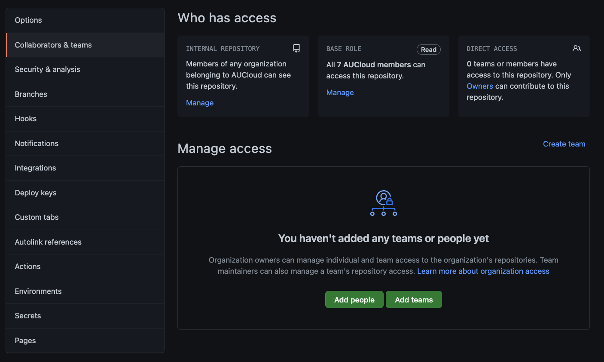

For RBAC two roles are recommended:

- Admin: Full access rights and overrides. To be issued to a more than one, however, a limited population (as it can bypass some controls).
- Write: Allows creation of PRs and committing code, but cannot bypass controls.

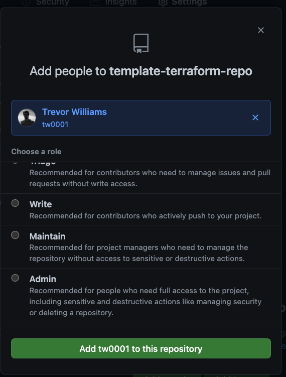

### General settings
The general settings

#### Configure Access
- Collaborators and teams
- Team and member roles

The following setting changes are suggested under the general `options` tab:

#### Remove un-needed features
- Disable forking (keeps things centralized)
- Disable projects (we use zenhub)
- Disable wikis (wikis are 1/2 baked in github - use github pages)

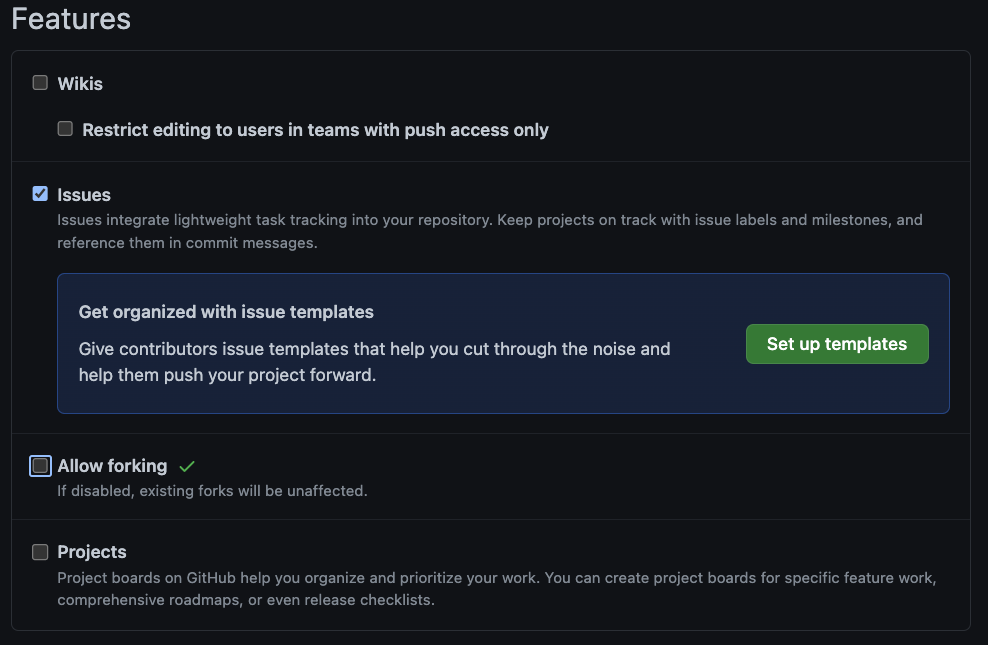

#### Clean up merge settings
Allow squash merging only:
- Squash merging makes it easy to control the commit messages going into your git history and keeps things 'clean' for end users
- Disable both merge and rebase commits

Allow automerge: ensures that simple changes can (optionally) fire off as soon as they are approved.

Automatically delete head branches: Keeps your github environment clean

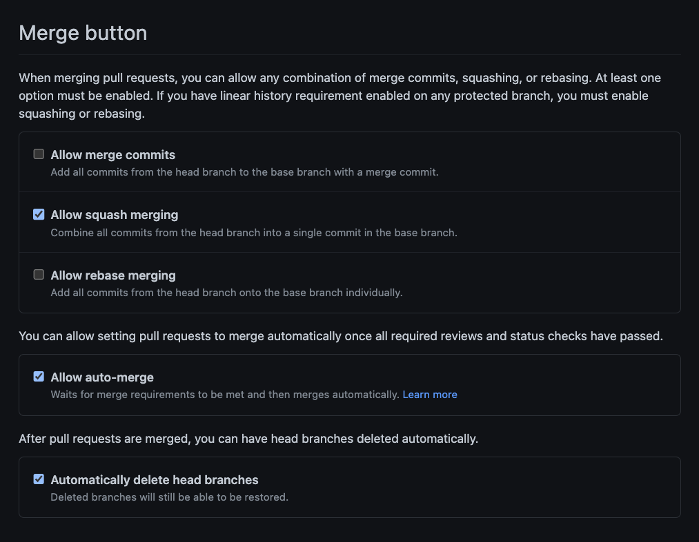

### Branch protection
Branch protection is a critical concept in github. It ensures that no user can re-write history and cannot act without automated and manual checks occurring.

In this template we protect the `main` branch

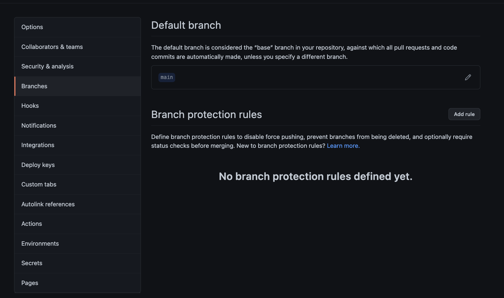

1. Forcing users who want to change the main branch to do so by opening a `pull request`
2. Forcing a review of the `pull requests` by peer review

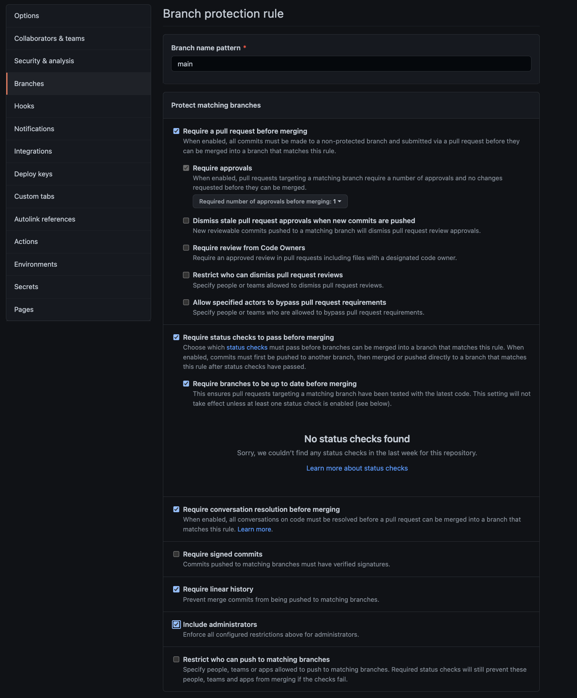

Status checks can only be configured once your pipelines are discovered by github. Ensure the jobs that you require fire on pull requests

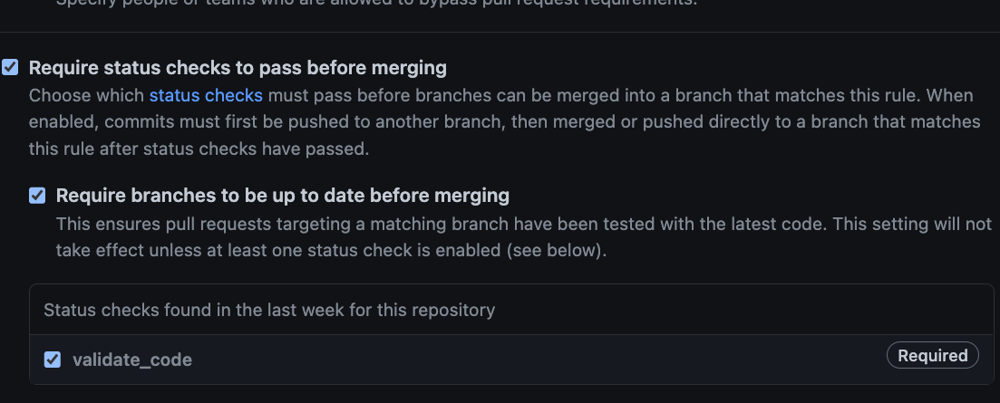

## Secrets & github secrets for terraform

Github secrets can be used for all secrets required. It's recommended that github secrets are used unless Hashicorp vault is avaiable.
1. Object storage access
2. Variables which change based on different target environments (e.g. VCD URLs)
3. Access tokens and other github related credentials

### Adding github secrets
Github secrets is a way to provide (primarily) credentials required for the github actions workflows.
Github actions can add credentials as:

1. For an `environment` which can be used to target different systems
2. For the repository irrespective of the environment.
3. For an organisation (currently unused).

Here you can see credentials added for object storage,  and github (to trigger workflows).

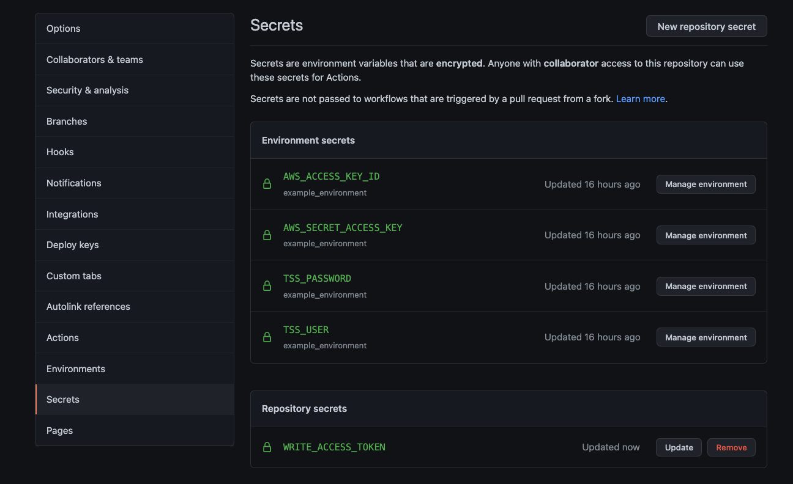

### Local development
In order to conduct local development and testing (e.g. running `terraform plan` a subset of the secrets will need to be made available to that development environment.

Users should aim to conduct the majority of dev via github actions workflows, rather than local development.
### object storage
In order to use object storage (aucloud StaaS) for the backend, credentials referenced by environmental variables:
Please note this is using aucloud StaaS.

- `AWS_ACCESS_KEY_ID`
- `AWS_SECRET_ACCESS_KEY`

must be present. They also MUST be put into the github secrets.

## Contributor workflow (using git cli not github desktop)
Assumptions:

- `git` is installed
  - ssh auth is pre-configured
- `terraform` is installed
- `python3` and `pip3` are installed (if using pre-commit)
### Initial local development setup 

- `git clone` the public repository
- cd into the new repository
- Setup your vscode / editing environment
- all of the followign steps presume you are in the project working directory
### Create a new branch to work on
- Ensure you have the latest from `main`
  - `git checkout main`
  - `git pull`
- Create a branch `git checkout -b my_feature_branch`
  
### pre commit checks
#### Terraform formatting
Terraform formatting *enforced* us run to minimize the PR change size.

- Save all `.tf` files
- `terraform fmt -recursive`

#### Terraform validate
Initialise terraform with the backend if you have s3 credentials

`terraform init -backend-config=environments/default/backend.tf`

Or without the backed if you do have not

`terraform init -backend=false`

Run `terraform validate` to perform pre-flight checks.
### Commit & push to origin

- Check for untracked files with `git status`
- Add untracked files you *want* committed with `git add`
- `git commit --signoff -sam 'my Commit message e.g. Firewall rule for cumulo'`
- `git push`
  - Note if it's the first push you will get an message on how to configure your origin for the branch
### Open PR
- Logon to github
- Create a PR. If this is a new branch if you visit the project URL you will get prompted.
  
#### Add reviewers
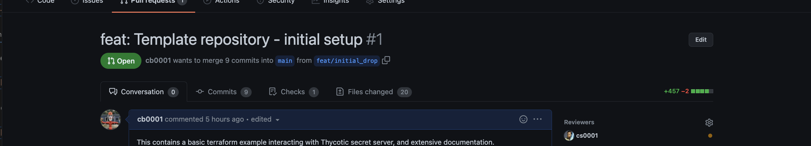

#### Check PR check's status and iterate until clean
Check the PR's status if it is failed (like the following diagram)

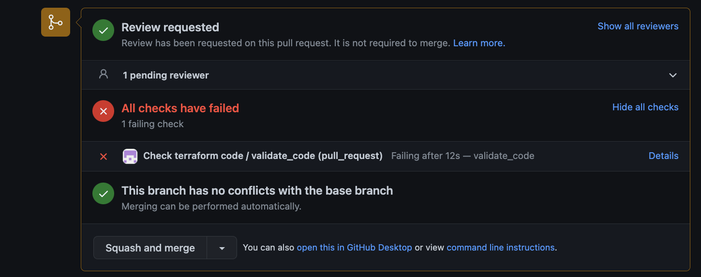

You can click into each status failure to investigate the pipeline e.g.

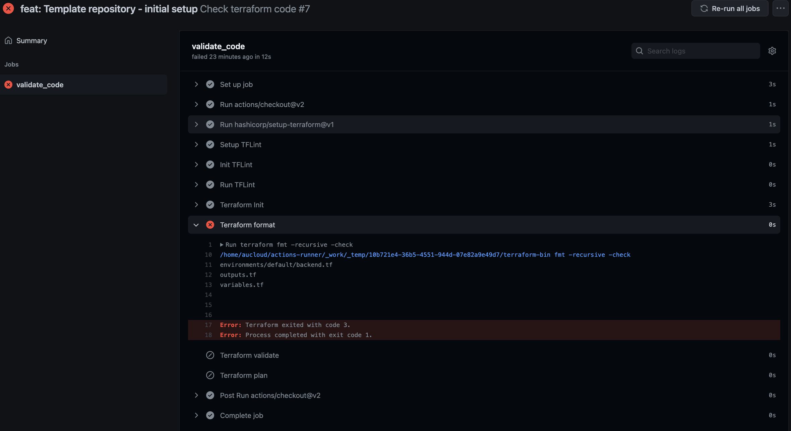

keep changing code until it passes

#### Squash and merge when ready and reviewed!

## Dealing with broken builds
Builds can get broken for a number of reasons such as:

- Manual editing of resources
- Certain terraform file edits (removing of resources before deletions)
- Problems with the downstream edits

If you are worried about edits
- Test in a non prod-environment OR
- Run a destroy workflow before merging code to ensure clean state

### Triage process
1. Attempt the destroy the resources
   1. Two pipelines are provided for running terraform destroy.
      1. One destroys and leaves it empty
      2. One destroys then triggers recreation of the resources
   2. Use the Workflow dispatch button to ensure code is up to date; and a unique github actions run is recoreded.

If a destroy run fail:
1. Try to repeatedly run destroy.
   1. Some resources may not be correctly coded into the DAG resulting in problems with destructions
2. If all else fails
   1. Manually delete / cleanup resources on the target system.
   2. Remove the state file manually (delete) from object storage.

